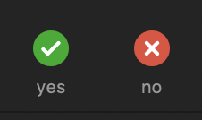
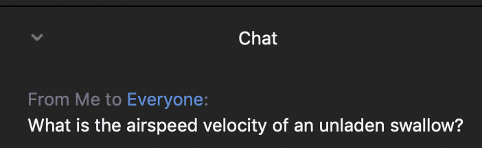

## Summer 2020 
# Quarterly Data Carpentry Workshop

---

Before we start...

## Code of Conduct

* We are dedicated to providing a welcoming and supportive environment for all people, regardless of background or identity.

---

## Code of Conduct

https://docs.carpentries.org/topic_folders/policies/code-of-conduct.html

---

## Code of Conduct

* Go to Instructors or Helpers if you feel the Code of Conduct is being violated.

* There is also a big blue "Report a Code of Conduct Incident" on the course website if you feel the Instructors are not handling appropriately.

---

## Introductions

### *Instructors and Helpers*

---

## Introductions

### *Learners*

---

## What is the Carpentries?

https://carpentries.org/

The Carpentries is a global volunteer-driven organization dedicated to teaching computational skills to researchers and anyone who works with data.

---

## Carpentries at the Smithsonian

https://datascience.si.edu/carpentries

The Smithsonian Carpentries Team is made up of Smithsonian staff and fellows from around the institution.

---

## Carpentries way of teaching

Code along, rather than lecturing from PowerPoint, or just demonstrating

Odds of running into an error are high, but don’t panic – this is a great opportunity to learn

---

## ***We won’t leave you behind***

---

### How to make sure we don't leave you behind

In the real world, we used to use Post-It notes to indicate progress, but for this workshop we'll use the "yes" / "no" buttons in the Zoom Participants panel.

---

## How to ask questions

The Instructors will try to build in time between lessons to ask questions, but use the Zoom chat for questions that come up during a lesson.

---

## Course GitHub repository

https://github.com/SmithsonianWorkshops/2020-08-11-smithsonian

---

## Course EtherPad

https://pad.carpentries.org/2020-08-11-smithsonian

A collaborative document – think of it as a stripped-down version of Google Docs

---

## Your first challenge

* Go to the EtherPad

* Add your name, unit, and your favorite emoji (😀) under Attendance Day 1

---

## What we will be teaching in this workshop

We will be teaching you data organization, cleaning, and visualization skills, so that your analyses can be easily understoood and reproduced by your colleagues ... and your future self.

---

## Day One (Today)

### Tidy Data Principles in Spreadsheets
### OpenRefine

---

## Day Two (Tomorrow)

### SQL

---

## Day Three (next Tue)

### Introduction to Programming in Python
### Working with data using Pandas

---

## Day Four (next Wed)

### Combining DataFrames
### Making plots with plotnine

---

> We will be teaching you a lot of valuable skills on a demo dataset, but you won't be able to add these tools to your *toolbag* until you work through how to apply them to your own data.

---

